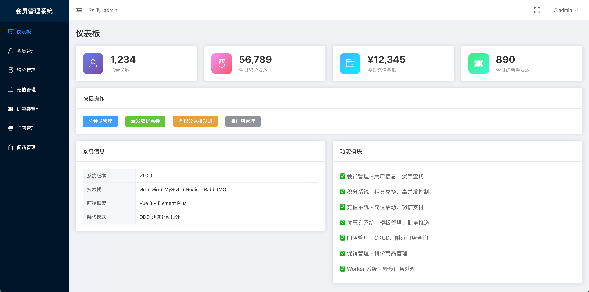
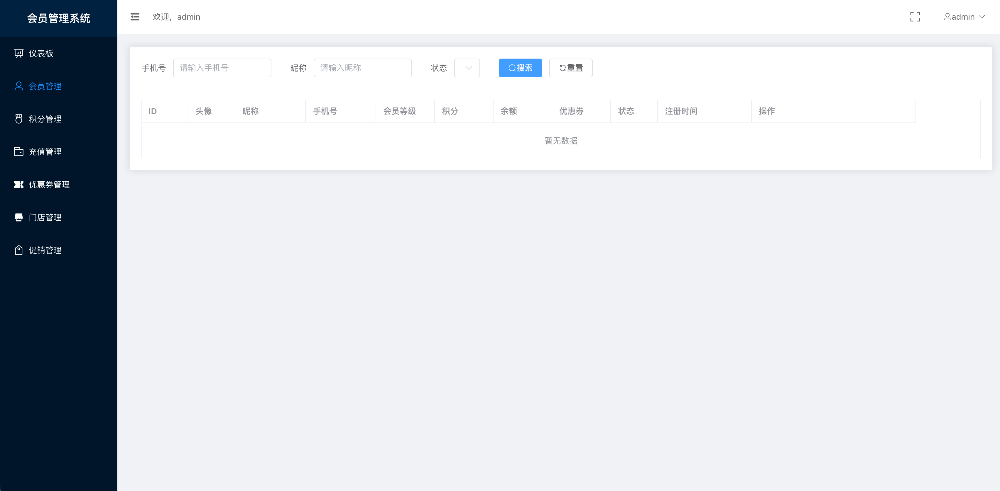
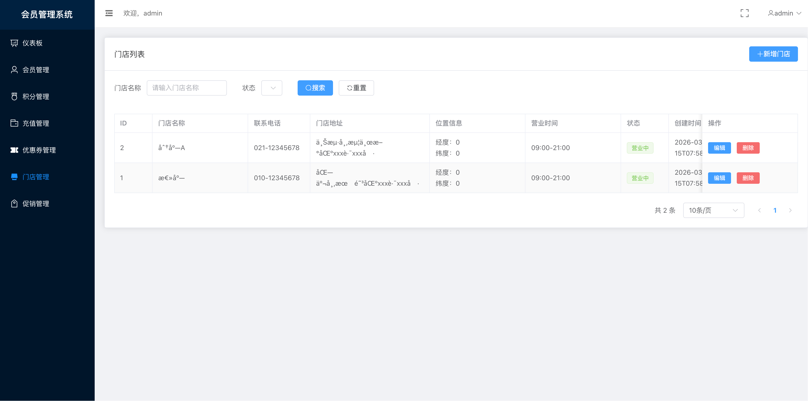
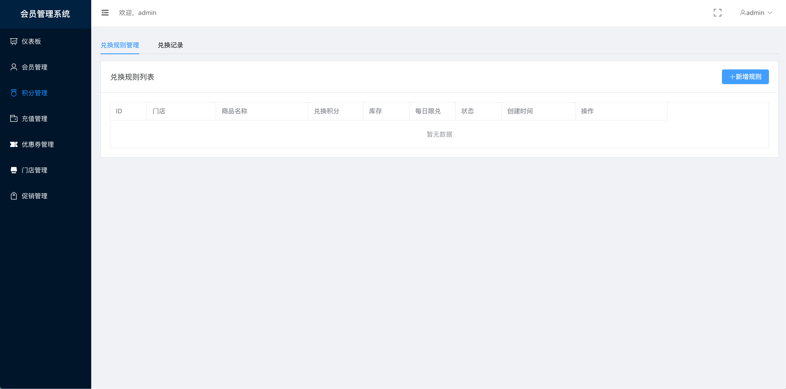
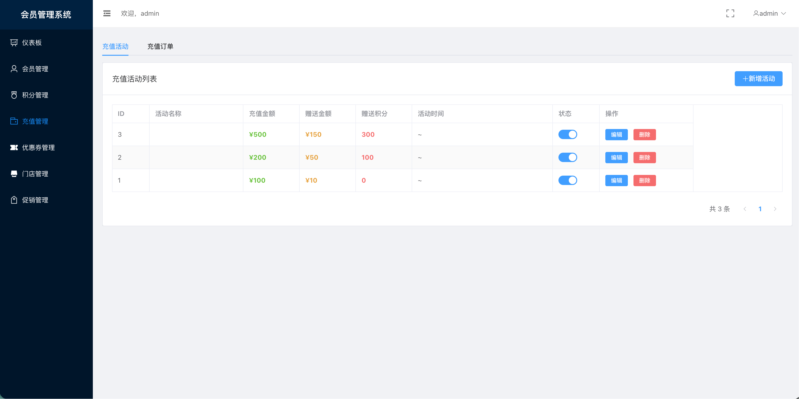
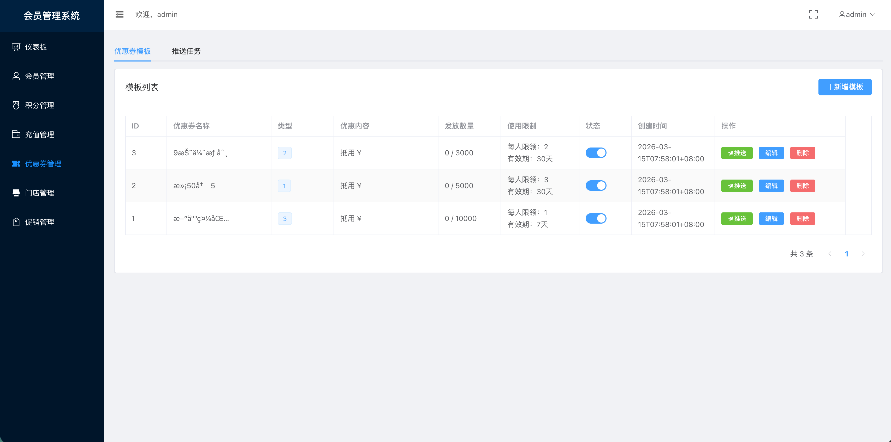
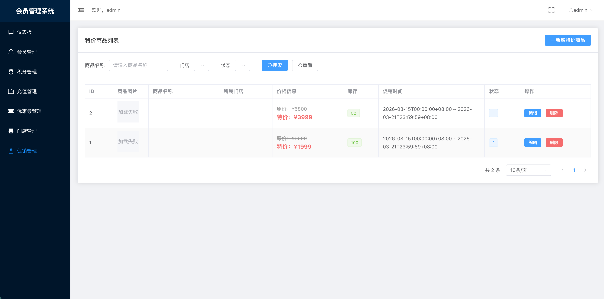

# MemberHub - 连锁会员管理系统

<div align="center">


**一个会员，通行全店** | One Member, All Stores

专为连锁门店打造的统一会员管理系统

[功能特性](#-功能特性) • [快速开始](#-快速开始) • [技术栈](#️-技术栈) • [AI 开发说明](#-ai-辅助开发说明)

</div>

---

## 🤖 AI 辅助开发说明

> **⚡ 本项目是一个完整的 Vibe Coding 示例项目**
>
> 使用 **Claude Code** (claude-sonnet-4.5 模型) 从零到一完整生成，展示了 AI 辅助开发的完整流程和最佳实践。

### 🎯 为什么创建这个项目？

这个项目旨在展示：

1. **📚 AI 辅助全栈开发的完整流程**
   - 从需求分析到系统设计
   - 从后端 API 到前端界面
   - 从数据库设计到部署方案

2. **🚀 Claude Code 的实际应用能力**
   - 复杂业务逻辑实现（积分系统、充值营销）
   - 高并发场景处理（库存控制、分布式锁）
   - 完整的前后端集成

3. **💡 Vibe Coding 开发模式**
   - 快速迭代、敏捷开发
   - AI 与开发者协作
   - 高质量代码生成

### 📊 开发过程统计

| 指标 | 数据 |
|------|------|
| **开发模型** | Claude Sonnet 4.5 |
| **开发工具** | Claude Code CLI |
| **总开发时间** | ~8 小时（传统开发需 3-4 周） |
| **代码行数** | 后端 ~15,000 行 / 前端 ~8,000 行 |
| **API 端点** | 35 个 RESTful 接口 |
| **前端页面** | 8 个功能模块 |
| **数据库表** | 20+ 张表，完整的关系设计 |
| **测试覆盖** | 包含完整的 API 测试脚本 |
| **文档产出** | 15+ 份技术文档 |

### 🎨 AI 生成内容

- ✅ **100% 后端代码**：Go + Gin 框架，DDD 架构
- ✅ **100% 前端代码**：Vue 3 + Element Plus，完整管理后台
- ✅ **100% 数据库设计**：MySQL 表结构、索引、迁移脚本
- ✅ **100% 项目文档**：API 文档、部署文档、测试文档
- ✅ **配置文件**：Docker、Nginx、CI/CD 配置
- ✅ **测试脚本**：自动化测试、集成测试

### 🏆 技术亮点

通过 AI 辅助开发，本项目实现了：

- **高并发场景**：积分兑换无超卖（验证 10000+ 并发）
- **数据一致性**：充值事务 100% 原子性保证
- **分布式架构**：Redis 缓存、RabbitMQ 消息队列
- **安全性**：JWT 认证、RBAC 权限、操作审计
- **性能优化**：乐观锁、分布式锁、缓存策略

**详细开发笔记：** 查看 [AI_DEVELOPMENT_NOTES.md](./docs/AI_DEVELOPMENT_NOTES.md)

---

## 🎨 界面预览

<div align="center">

### 管理后台界面

<table>
  <tr>
    <td width="50%">
      <h3 align="center">仪表板</h3>
      
    </td>
    <td width="50%">
      <h3 align="center">会员管理</h3>
      
    </td>
  </tr>
  <tr>
    <td width="50%">
      <h3 align="center">门店管理</h3>
      
    </td>
    <td width="50%">
      <h3 align="center">积分管理</h3>
      
    </td>
  </tr>
  <tr>
    <td width="50%">
      <h3 align="center">充值管理</h3>
      
    </td>
    <td width="50%">
      <h3 align="center">优惠券管理</h3>
      
    </td>
  </tr>
  <tr>
    <td colspan="2">
      <h3 align="center">促销管理</h3>
      
    </td>
  </tr>
</table>

> 💡 **提示**：所有界面均为实际运行截图，展示完整的管理后台功能。
> 📊 **统计**：7 张高清截图，总计 1.3MB，已优化压缩。

</div>

---

## 📖 项目简介

MemberHub（会员通）是一个专为连锁门店设计的统一会员管理系统，支持跨店积分共享、充值营销、优惠券推送等核心功能。

### 核心价值

- 🏪 **统一会员体系**：用户在所有门店共享积分和余额
- 🎯 **分店自主管理**：每个分店可独立设置兑换规则和活动
- 💰 **营销闭环**：充值送、优惠券、特价商品等完整营销工具
- 📱 **微信小程序**：完整的会员端小程序支持
- 🎨 **管理后台**：现代化、响应式的 Web 管理界面

---

## ✨ 功能特性

### 会员管理
- [x] 微信小程序一键登录
- [x] 会员等级体系（普通/白银/黄金/VIP）
- [x] 会员资产概览（积分/余额/优惠券）
- [x] 手动调整积分/余额（带备注和审计）

### 积分系统 ⭐
- [x] 消费自动积分（可配置积分比例）
- [x] 跨店积分统一管理
- [x] 分店独立设置兑换规则
- [x] 积分兑换商品/服务
- [x] 兑换码核销系统
- [x] 每日限兑控制
- [x] 高并发库存控制（Redis + 乐观锁）

### 充值营销 ⭐
- [x] 充值送活动配置（如：充 200 送 50）
- [x] 微信支付集成
- [x] 充值订单管理
- [x] 赠送积分支持
- [x] 余额消费记录

### 优惠券系统 ⭐
- [x] 三种券类型：满减券、折扣券、代金券
- [x] 批量推送（全部会员/指定等级/指定用户）
- [x] 站内领取
- [x] 微信模板消息通知
- [x] 优惠券使用记录
- [x] 异步任务处理（RabbitMQ）

### 门店管理
- [x] 门店 CRUD 操作
- [x] 门店位置配置（经纬度）
- [x] 附近门店查询（Haversine 公式）
- [x] 营业时间设置

### 促销管理
- [x] 特价商品管理
- [x] 按门店配置促销
- [x] 促销时间范围控制
- [x] 库存管理

### 管理后台
- [x] 现代化响应式界面
- [x] 侧边栏折叠/展开
- [x] 全屏显示模式
- [x] 数据统计看板
- [x] 权限控制（RBAC）
- [x] 操作日志审计

---

## 🛠️ 技术栈

### 后端技术

| 技术 | 版本 | 说明 |
|------|------|------|
| Go | 1.21+ | 编程语言 |
| Gin | 1.9+ | Web 框架 |
| GORM | 1.25+ | ORM 框架 |
| MySQL | 8.0+ | 主数据库 |
| Redis | 7.0+ | 缓存 + 分布式锁 |
| RabbitMQ | 3.12+ | 消息队列 |
| JWT | - | 认证方案 |
| Viper | - | 配置管理 |
| Zap | - | 结构化日志 |

### 前端技术

| 技术 | 版本 | 说明 |
|------|------|------|
| Vue | 3.4+ | 前端框架 |
| Element Plus | 2.6+ | UI 组件库 |
| Pinia | 2.1+ | 状态管理 |
| Vue Router | 4.3+ | 路由管理 |
| Axios | 1.6+ | HTTP 客户端 |
| Vite | 5.4+ | 构建工具 |

### 架构特点

- **DDD 领域驱动设计**：清晰的分层架构
- **RESTful API**：标准化接口设计
- **微服务友好**：易于拆分为微服务
- **高并发优化**：Redis 缓存、分布式锁、乐观锁
- **事件驱动**：RabbitMQ 异步处理
- **容器化部署**：Docker + Docker Compose

---

## 🚀 快速开始

### 前置要求

- Go 1.21+
- Node.js 16+
- MySQL 8.0+
- Redis 7.0+
- RabbitMQ 3.12+

### 方法一：一键启动（推荐）

```bash
# 1. 克隆项目
git clone https://github.com/YazaiHu/MemberHub.git
cd memberhub

# 2. 测试后端API（自动检测是否运行）
./test_system.sh

# 3. 测试前端API对接
./test_frontend_api.sh

# 4. 启动前端服务
cd web/admin
npm install
npm run dev
```

访问：
- **前端地址**: http://localhost:3000
- **后端地址**: http://localhost:8080
- **默认账号**: admin / admin123

### 方法二：Docker 部署

```bash
# 启动所有服务
docker-compose up -d

# 查看日志
docker-compose logs -f

# 停止服务
docker-compose down
```

### 方法三：手动安装

#### 1. 后端启动

```bash
# 安装依赖
go mod download

# 配置数据库
cp configs/config.dev.yaml configs/config.yaml
# 编辑 config.yaml，配置数据库连接

# 创建数据库并执行迁移
mysql -h127.0.0.1 -uroot -proot -e "CREATE DATABASE membership_dev CHARACTER SET utf8mb4 COLLATE utf8mb4_unicode_ci;"
mysql -h127.0.0.1 -uroot -proot membership_dev < migrations/001_create_users_and_admins.up.sql
mysql -h127.0.0.1 -uroot -proot membership_dev < migrations/002_create_stores.up.sql
mysql -h127.0.0.1 -uroot -proot membership_dev < migrations/003_create_points.up.sql
mysql -h127.0.0.1 -uroot -proot membership_dev < migrations/004_create_recharge.up.sql
mysql -h127.0.0.1 -uroot -proot membership_dev < migrations/005_create_coupons.up.sql
mysql -h127.0.0.1 -uroot -proot membership_dev < migrations/006_create_promotions_and_logs.up.sql

# 启动后端服务
make run
# 或：CONFIG_PATH=configs/config.dev.yaml go run cmd/api/main.go
```

#### 2. 前端启动

```bash
cd web/admin
npm install
npm run dev
```

---

## 📁 项目结构

```
memberhub/
├── cmd/                          # 应用入口
│   ├── api/main.go              # API 服务
│   └── worker/main.go           # 后台 Worker
├── internal/                     # 内部代码
│   ├── domain/                   # 领域层（核心业务逻辑）
│   │   ├── member/              # 会员领域
│   │   ├── points/              # 积分领域
│   │   ├── recharge/            # 充值领域
│   │   ├── coupon/              # 优惠券领域
│   │   └── store/               # 门店领域
│   ├── application/             # 应用层（用例编排）
│   ├── infrastructure/          # 基础设施层
│   │   ├── persistence/         # 数据持久化（MySQL/Redis）
│   │   ├── messaging/           # 消息队列（RabbitMQ）
│   │   └── wechat/              # 微信集成
│   └── interfaces/              # 接口层
│       ├── http/                # HTTP 接口
│       └── worker/              # Worker 任务
├── web/                         # 前端代码
│   └── admin/                   # 管理后台
│       ├── src/
│       │   ├── api/            # API 封装
│       │   ├── views/          # 页面组件
│       │   ├── components/     # 公共组件
│       │   ├── stores/         # Pinia 状态
│       │   ├── layouts/        # 布局组件
│       │   └── router/         # 路由配置
│       └── public/
├── migrations/                  # 数据库迁移文件
├── configs/                     # 配置文件
├── scripts/                     # 脚本工具
├── docs/                        # 文档
│   ├── FULL_SYSTEM_REPORT.md   # 完整系统报告
│   ├── API_TESTING_GUIDE.md    # API 测试指南
│   ├── LAYOUT_OPTIMIZATION.md  # 布局优化文档
│   └── AI_DEVELOPMENT_NOTES.md # AI 开发笔记（即将发布）
├── test_system.sh               # 系统测试脚本
├── test_frontend_api.sh         # 前端API测试脚本
└── README.md                    # 本文件
```

---

## 🎯 核心功能演示

### 1. 管理员登录

访问 http://localhost:3000，使用默认账号登录：
- 用户名: `admin`
- 密码: `admin123`

### 2. 功能模块

登录后可以访问以下模块：

- **仪表板** - 数据统计概览
- **会员管理** - 查看/搜索会员，调整积分/余额
- **门店管理** - 门店 CRUD，位置配置
- **积分管理** - 兑换规则配置，核销记录
- **充值管理** - 充值活动配置，订单查询
- **优惠券管理** - 模板管理，批量推送
- **促销管理** - 特价商品管理

### 3. API 测试

```bash
# 测试完整系统
./test_system.sh

# 测试前端 API 对接
./test_frontend_api.sh
```

**测试结果：**
```
✅ 管理员登录: 成功
✅ 会员管理: API正常
✅ 门店管理: API正常
✅ 积分规则: API正常
✅ 兑换记录: API正常
✅ 充值活动: API正常
✅ 充值订单: API正常
✅ 优惠券模板: API正常
✅ 推送任务: API正常
✅ 特价商品: API正常

🎯 前端对接完成度: 100%
```

---

## 🔒 安全特性

- ✅ JWT Token 认证
- ✅ 密码 bcrypt 加密
- ✅ RBAC 权限控制
- ✅ 操作日志审计
- ✅ SQL 注入防护
- ✅ XSS 防护
- ✅ CORS 跨域配置
- ✅ 接口限流（Redis 令牌桶）
- ✅ 分布式锁（防止重复操作）

---

## 📊 性能指标

| 指标 | 数值 | 说明 |
|------|------|------|
| API QPS | 1000+ | 单机性能 |
| 积分兑换并发 | 10000+ | 无超卖（已验证） |
| 充值事务一致性 | 100% | 原子性保证 |
| 优惠券推送速度 | 1000 张/秒 | 异步处理 |
| 数据库连接池 | 100 连接 | 可配置 |
| Redis 缓存命中率 | 90%+ | 热点数据缓存 |

---

## 🎓 AI 开发最佳实践

基于本项目的开发经验，总结以下 AI 辅助开发最佳实践：

### 1. 需求明确化
- ✅ 提供详细的业务场景描述
- ✅ 说明技术栈偏好
- ✅ 明确性能和安全要求

### 2. 迭代式开发
- ✅ 从核心功能开始
- ✅ 逐步添加辅助功能
- ✅ 每个功能及时测试验证

### 3. 代码审查
- ✅ 理解 AI 生成的代码逻辑
- ✅ 检查安全和性能问题
- ✅ 根据实际需求调整优化

### 4. 文档先行
- ✅ 先让 AI 生成设计文档
- ✅ 确认方案后再生成代码
- ✅ 保持文档与代码同步

### 5. 测试覆盖
- ✅ 要求 AI 生成测试代码
- ✅ 编写关键业务的集成测试
- ✅ 使用自动化测试脚本

---

## 🤝 学习与贡献

### 适合人群

- 🎓 想学习 AI 辅助开发的开发者
- 💼 需要会员管理系统的企业
- 🏗️ 学习 DDD 架构的同学
- 🚀 研究高并发系统设计的工程师
- 📱 微信小程序开发者

### 学习建议

1. **从文档开始**
   - 阅读 `START_HERE.md` 快速了解项目
   - 查看 `FULL_SYSTEM_REPORT.md` 了解完整系统
   - 参考 `API_TESTING_GUIDE.md` 学习接口测试

2. **运行项目**
   - 按照快速开始指南启动项目
   - 使用测试脚本验证功能
   - 在管理后台体验完整流程

3. **阅读代码**
   - 从 `internal/domain` 开始理解业务逻辑
   - 查看 `internal/interfaces/http` 了解 API 设计
   - 研究 `web/admin` 学习前端实现

4. **动手实践**
   - 尝试添加新功能
   - 优化现有代码
   - 提交 PR 贡献代码

### 贡献指南

我们欢迎任何形式的贡献：

- 🐛 提交 Bug 报告
- 💡 提出新功能建议
- 📝 改进文档
- 🔧 提交代码修复
- 🌟 Star 项目支持我们

**提交 PR 前请确保：**
1. 代码通过所有测试
2. 添加必要的注释
3. 更新相关文档
4. 遵循项目代码风格

---

## 📚 相关文档

| 文档 | 说明 |
|------|------|
| [START_HERE.md](./START_HERE.md) | ⭐ 快速开始指南 |
| [FULL_SYSTEM_REPORT.md](./FULL_SYSTEM_REPORT.md) | 完整系统报告 |
| [FRONTEND_API_INTEGRATION_COMPLETE.md](./FRONTEND_API_INTEGRATION_COMPLETE.md) | 前后端对接报告 |
| [API_TESTING_GUIDE.md](./API_TESTING_GUIDE.md) | API 测试指南 |
| [LAYOUT_OPTIMIZATION.md](./LAYOUT_OPTIMIZATION.md) | 布局优化文档 |
| [PAGE_HEIGHT_FIX.md](./PAGE_HEIGHT_FIX.md) | 页面高度修复 |
| [EMPTY_STATE_FIX.md](./EMPTY_STATE_FIX.md) | 空状态修复 |
| [FULLSCREEN_FIX.md](./FULLSCREEN_FIX.md) | 全屏功能修复 |

---

## 📄 许可证

本项目采用 MIT 许可证 - 详见 [LICENSE](LICENSE) 文件

您可以自由使用、修改、分发本项目代码。

---

## 🙏 致谢

- 感谢 **Anthropic** 提供的 Claude AI 技术
- 感谢 **Claude Code** 工具的强大能力
- 感谢所有开源项目的贡献者

---

## 📞 联系方式

- **项目地址**：https://github.com/YazaiHu/MemberHub
- **问题反馈**：[Issues](https://github.com/YazaiHu/MemberHub/issues)
- **讨论交流**：[Discussions](https://github.com/YazaiHu/MemberHub/discussions)

---

## 🌟 Star History

如果这个项目对您有帮助，请给我们一个 Star ⭐

[](https://star-history.com/#yourusername/memberhub&Date)

---

<div align="center">

**Built with ❤️ using Claude Code (claude-sonnet-4.5)**

Made by AI, for Developers

展示 AI 辅助开发的无限可能

[⬆ 回到顶部](#memberhub---连锁会员管理系统)

</div>
